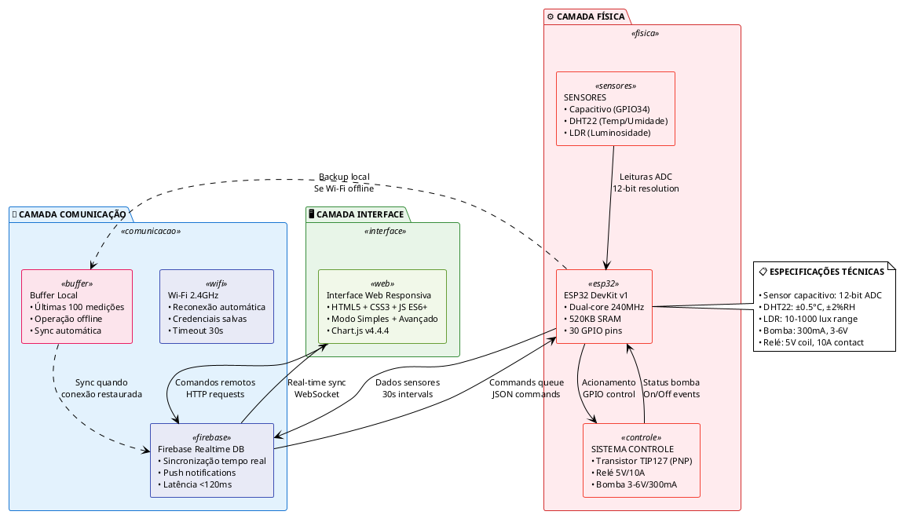

# Diagrama da Arquitetura do Sistema em 3 Camadas - PlantUML

## Código PlantUML



## Como Usar Este Diagrama PlantUML

### 1. Renderização Online
- **Acesse**: https://www.plantuml.com/plantuml/
- **Cole o código** acima na caixa de texto
- **Clique** em "Submit" para gerar
- **Baixe** como PNG, SVG ou PDF

### 2. Alternativa: PlantUML Editor Online
- **Acesse**: https://plantuml-editor.kkeisuke.com/
- **Interface mais amigável** com preview ao vivo
- **Cole o código** e veja o resultado instantaneamente

### 3. Para seu TCC LaTeX
```latex
\begin{figure}[htbp]
\centering
\includegraphics[width=0.9\textwidth]{figuras/arquitetura_sistema_plantuml.png}
\caption{Arquitetura do sistema em três camadas: física, comunicação e interface}
\label{fig:arquitetura_sistema}
\end{figure}
```

### 4. Usando VS Code (Opcional)
Se quiser editar localmente:
1. Instalar extensão "PlantUML"
2. Salvar arquivo como `.puml`
3. Ctrl+Shift+P → "PlantUML: Preview Current Diagram"

## Vantagens do PlantUML vs Mermaid

### ✅ **Mais Simples:**
- Sintaxe mais clara e legível
- Menos configuração necessária
- Melhor controle de layout

### ✅ **Melhor para Arquitetura:**
- Packages (camadas) bem definidos
- Setas personalizáveis (sólidas/tracejadas)
- Notes para especificações técnicas

### ✅ **Saída de Qualidade:**
- PNG/SVG em alta resolução
- Fontes e cores consistentes
- Layout automático otimizado

## Características do Diagrama PlantUML

- **3 camadas** claramente separadas em packages coloridos
- **Fluxo de dados** com setas direcionais e legendas
- **Redundâncias** destacadas com setas tracejadas
- **Especificações técnicas** em notes laterais
- **Cores diferenciadas** para cada tipo de componente
- **Layout profissional** adequado para TCC acadêmico

## Customizações Possíveis

Se quiser ajustar:
- **Cores**: Modificar valores nos `skinparam`
- **Layout**: Ajustar posicionamento dos elements
- **Texto**: Editar conteúdo dos retângulos
- **Setas**: Alterar estilos e direções

Este diagrama PlantUML oferece muito mais controle e clareza visual que o Mermaid equivalente!
