# Diagrama da Metodologia Design Science Research - Sistema IoT para Plantas

## Código Mermaid

```mermaid
flowchart LR
    %% Estilos para cada etapa
    classDef problema fill:#ffebee,stroke:#d32f2f,stroke-width:2px
    classDef objetivos fill:#e8f5e8,stroke:#388e3c,stroke-width:2px
    classDef design fill:#e3f2fd,stroke:#1976d2,stroke-width:2px
    classDef demo fill:#fff3e0,stroke:#f57c00,stroke-width:2px
    classDef avaliacao fill:#f3e5f5,stroke:#7b1fa2,stroke-width:2px
    classDef comunicacao fill:#fce4ec,stroke:#c2185b,stroke-width:2px
    
    %% As 6 etapas da metodologia DSR organizadas horizontalmente
    A["🔍 IDENTIFICAÇÃO<br/>DO PROBLEMA<br/><br/>Dificuldades no cuidado<br/>de plantas domésticas"]:::problema
    
    B["🎯 DEFINIÇÃO DE<br/>OBJETIVOS<br/><br/>Sistema IoT com<br/>interface adaptativa"]:::objetivos
    
    C["⚙️ DESIGN E<br/>DESENVOLVIMENTO<br/><br/>ESP32 + Firebase +<br/>Interface Web"]:::design
    
    D["🚀 DEMONSTRAÇÃO<br/><br/>Protótipo funcional<br/>3 vasos testados"]:::demo
    
    E["📊 AVALIAÇÃO<br/><br/>Métricas técnicas +<br/>Experiência usuário"]:::avaliacao
    
    F["📋 COMUNICAÇÃO<br/><br/>TCC + Código<br/>disponibilizado"]:::comunicacao
    
    %% Fluxo sequencial principal horizontal
    A --> B --> C --> D --> E --> F
    
    %% Iterações baseadas em feedback
    E -.->|Refinamentos| C
    D -.->|Ajustes| C
```



## Como Usar Este Diagrama

### 1. Renderização Online
- Acesse: https://mermaid.live/
- Cole o código acima
- Baixe como PNG, SVG ou PDF

### 2. VS Code
- Instale a extensão "Mermaid Preview"
- Abra este arquivo .md
- Use Ctrl+Shift+P → "Mermaid Preview"

### 3. Para seu TCC LaTeX
```latex
\begin{figure}[htbp]
\centering
\includegraphics[width=0.9\textwidth]{figuras/metodologia_dsr.png}
\caption{Metodologia Design Science Research aplicada ao desenvolvimento do sistema IoT}
\label{fig:metodologia_dsr}
\end{figure}
```

### 4. Outras Opções
- GitHub/GitLab (renderiza automaticamente)
- Notion, Obsidian, Typora
- Plugins para Word/PowerPoint

## Características do Diagrama

- **6 etapas DSR** claramente definidas
- **Timeline específico** do seu projeto
- **Marcos e entregas** detalhados
- **Iterações e refinamentos** baseados em feedback
- **Cores diferenciadas** para cada etapa
- **Layout profissional** adequado para TCC acadêmico
- **Informações técnicas** específicas do seu sistema IoT

Este diagrama pode ser usado diretamente na Seção 3 (Materiais e Métodos) do seu TCC como a "IMAGEM 2" que você mencionou.
