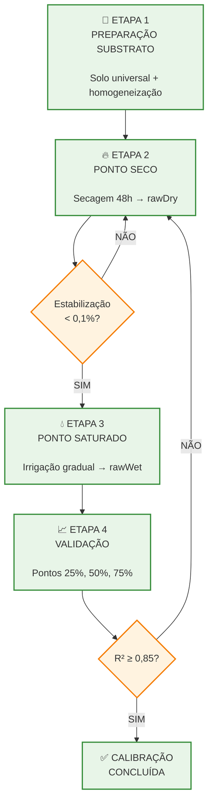

# Fluxograma do Protocolo de Calibração Experimental - Sistema IoT

## Código Mermaid



## Tempos Específicos do Protocolo

| **Etapa** | **Duração** | **Frequência** | **Critério** |
|-----------|-------------|----------------|--------------|
| Preparação | 30 min | Uma vez | Visual (homogeneidade) |
| Ponto Seco | 48h | Medições cada 4h | Variação < 0,1% |
| Ponto Saturado | 2-4h | Irrigação 50ml/5min | Sem drenagem 30min |
| Equilíbrio | 2h | Uma vez | Estabilização leituras |
| Validação | 4-6h | Pontos 25%, 50%, 75% | R² ≥ 0,85 |

## Como Usar Este Diagrama

### 1. Renderização Online
- Acesse: https://mermaid.live/
- Cole o código acima
- Baixe como PNG, SVG ou PDF

### 2. Para seu TCC LaTeX
```latex
\begin{figure}[htbp]
\centering
\includegraphics[width=0.85\textwidth]{figuras/protocolo_calibracao.png}
\caption{Fluxograma do protocolo de calibração experimental para diferentes volumes de vaso}
\label{fig:protocolo_calibracao}
\end{figure}
```

## Características do Fluxograma

- **4 etapas principais** do protocolo de calibração
- **Tempos específicos** para cada fase
- **Critérios de qualidade** claramente definidos
- **Pontos críticos** destacados com avisos
- **Fluxo de decisão** com loops de repetição
- **Validação estatística** com critério R² ≥ 0,85
- **Layout profissional** adequado para TCC acadêmico

Este diagrama pode ser usado diretamente na Seção 3 (Materiais e Métodos) do seu TCC como a "IMAGEM 3" do protocolo de calibração experimental.
